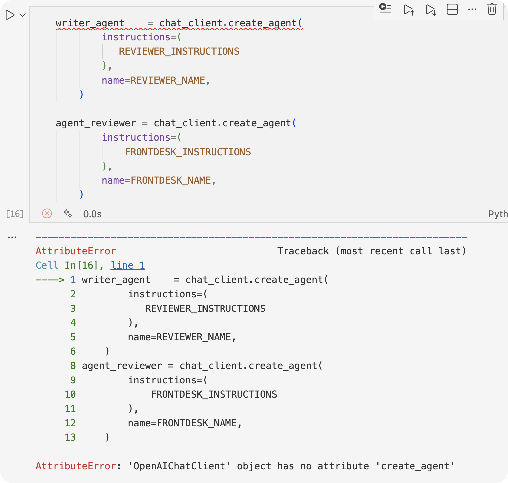
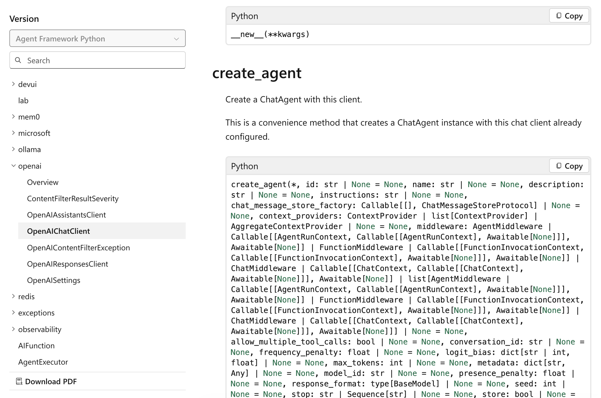
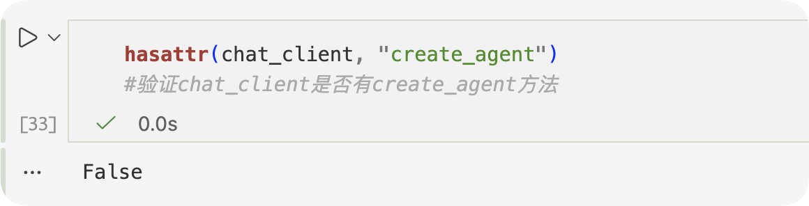

# Course 08 学习笔记（Multi‑Agent）

- 日期：2026-01-27
- 学习时长：40min

## 课程目标与核心收获
- 理解多代理（Multi‑Agent）系统的基本概念与协作模式：如何将复杂任务分配给多个专门化代理并协调它们完成整体目标。
- 掌握代理间通信、任务分配（Task Allocation）、冲突解决（Conflict Resolution）与协调协议（Coordination Protocols）。
- 学会使用 Microsoft Agent Framework 构建多代理工作流，包含顺序（Sequential）、并行（Concurrent）与条件分支（Conditional）编排模式。

## 关键术语与模式（英文保留并解释）
- Multi‑Agent System（多代理系统）：由多个自治代理组成的系统，代理之间可协作或竞争以完成更复杂任务。
- Agent Communication（代理通信）：代理间交换消息或结构化数据的方式，常见协议包括基于消息的 API、事件总线或共享存储。
- Task Allocation（任务分配）：把总体任务拆分并分配给最合适的代理，考虑能力、负载与资源约束。
- Coordination Protocols（协调协议）：定义代理如何同步、达成一致、或在冲突发生时决策（如仲裁、投票、优先级策略）。
- Fault Tolerance（容错）：设计替代路径与重试策略以应对单个代理失败。
- Orchestration vs Choreography（编排 vs 协同）：编排由中心化控制器调度；协同为各代理通过协议自组织。

## 示例与实践要点
- 架构模式：用一个 `Planner` 代理负责任务分解与调度，若干 `Executor`/`Worker` 代理负责具体执行，`Monitor` 代理负责进度与错误监控。
- 使用 Microsoft Agent Framework：通过 `ChatAgent`（或 workflow builder）注册多个代理，使用消息对象（`ChatMessage` / 数据模型）实现信息传递。
- 编排策略：对可并行执行的子任务并行发起请求，对有依赖关系的子任务按顺序执行并在每步加入校验点与回退逻辑。
- 失败处理：在关键步骤加入超时、重试与回退（rollback）策略；为高风险操作设计人工审批（HITL）。
- 状态与可观测性：为每个子任务记录状态（pending/running/succeeded/failed）、参与代理、证据与时间戳，便于审计与恢复。

## 易错点与排查
- 不清晰的接口契约：代理间消息格式或响应结构不一致会导致解析错误。建议使用 Pydantic 等模型进行严格约束。
- 竞态条件（Race Conditions）：并行执行时缺乏锁或幂等处理会造成重复操作或冲突。
- 单点故障：中心化编排器若无容错会影响全局，考虑冗余或将关键逻辑分散到多个角色。
- 资源争用：并行代理同时请求同一受限资源（API 配额、数据库）时需加队列或速率限制。
- 调试困难：多代理系统的追踪更复杂，确保日志中包含消息 ID、trace id 与上下文链路。

## BUG
环境：python3.13.2，venv

涉及的库：`from agent_framework.openai import OpenAIChatClient`

报错如下，不存在该特性：

但是在微软的API文档里找到了

AI教我用这个再次验证，返回了false，看来是真没有

我后来还把这个库更新到最新了，但还是没有

## 参考与下一步
- 课程资料与示例：查看 `08-multi-agent` 目录下的 workflow 示例与 notebook，学习 `SequentialBuilder`、`ConcurrentBuilder` 等工具用法。
- 推荐练习：
  - 构建一个三角色多代理演示（Planner / Worker / Monitor），实现任务分配、并行执行与失败回退。
  - 为多代理系统加入链路追踪（trace id）与审计日志，验证在单代理失败时能正确恢复。 

## 下节课预习（Metacognition）
- 主题：元认知（Metacognition）在代理中的应用：如何让代理检测自身失败、反思并改进规划与决策。
- 关键术语：Reflection、Self‑Evaluation、Retry Heuristics、Failure Diagnosis。
- 练习建议：为已有 Planner 实现简单的反思回路：在任务失败时分析失败原因并生成改进后的重新计划。
